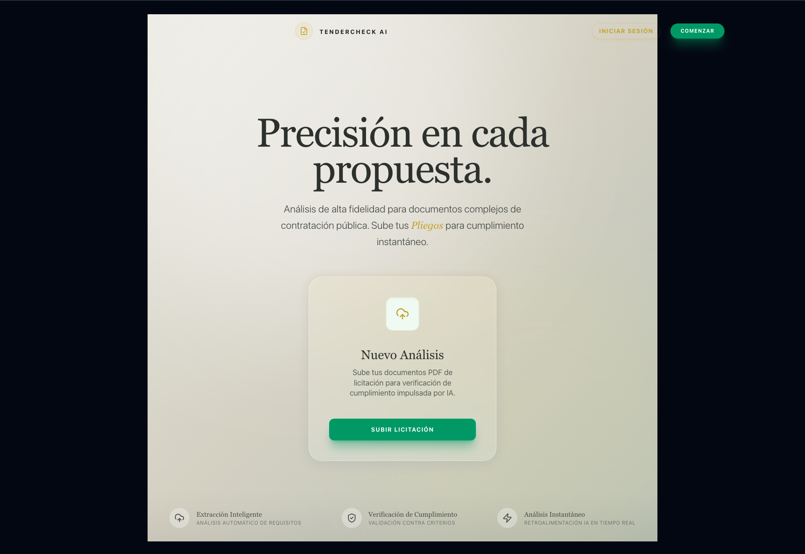
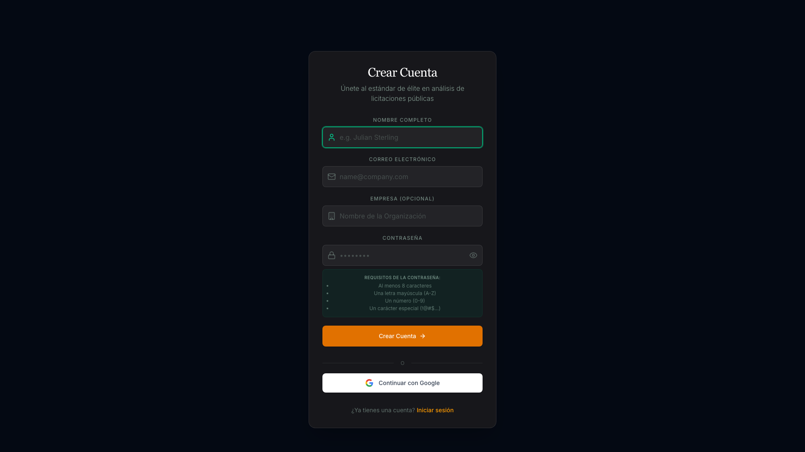
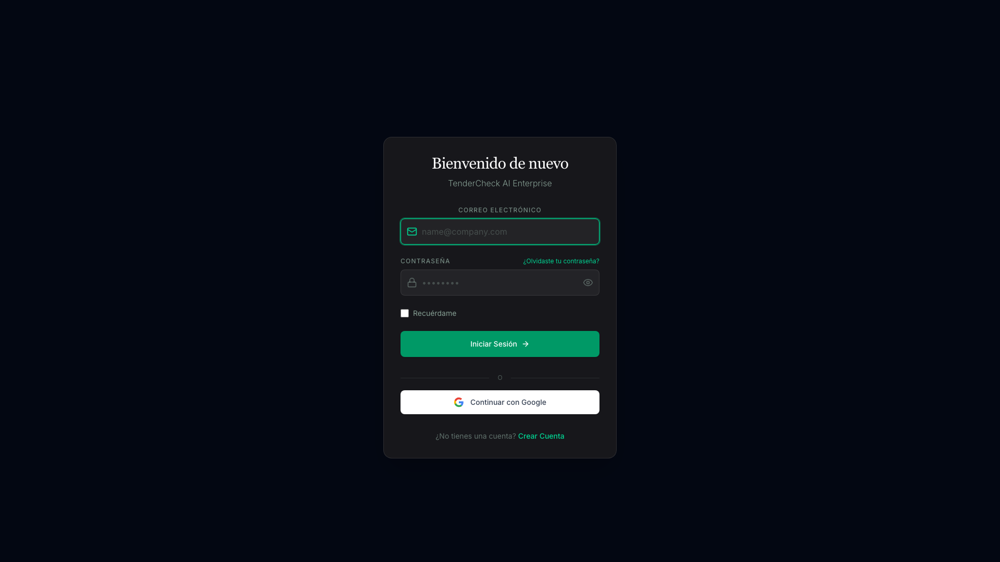
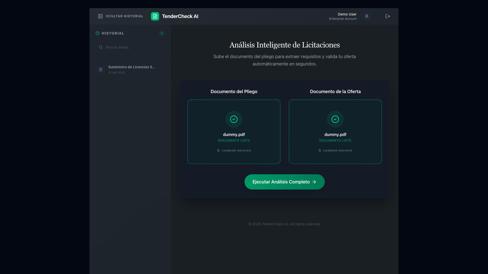
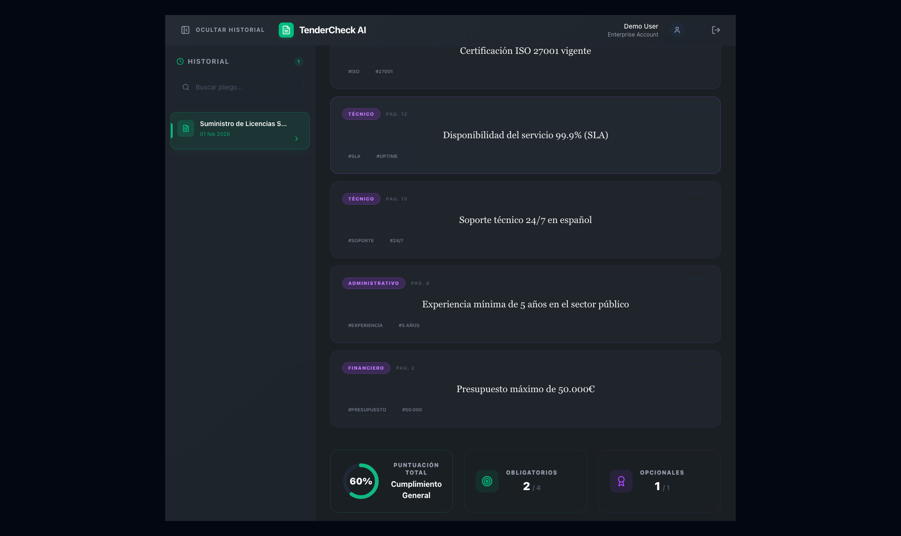
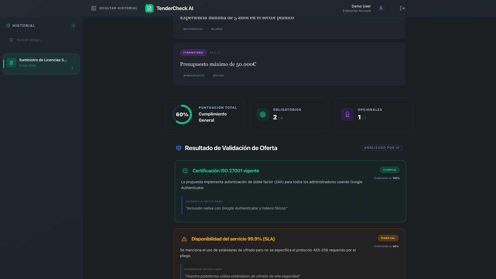

# TenderCheck AI 🤖

> **Automated Formal Validation for Public Tenders**
>
> [**🚀 Ver Demo en Vivo (Render)**](https://tendercheck-frontend.onrender.com)


-blue)


## 🚀 Key Features
- **Secure Authentication**: Robust Email/Password login (JWT + HttpOnly Cookies) and Google OAuth integration (Development only, see deployment notes).
- **PDF Analysis**: Extracts text from tender documents to identify key requirements using **Gemini 2.5 Flash** (Fast, Free Tier compatible).
- **Requirement Extraction**: Identifies technical clauses, distinguishing **OBLIGATORIO** vs **OPCIONAL**.
- **Real Proposal Validation**: Real-time comparison of vendor proposals with AI reasoning.
- **Improved AI Summary**: Detailed analysis summaries up to 500 characters (truncated from 100 in previous versions).
- **Intelligent Analysis (Dual Persona)**: 
  - **Legal Auditor (Extraction)**: Identifies strict requirements ("deberá", "obligatorio").
  - **Senior Evaluator (Validation)**: Understands technical synonyms and partial compliance nuances.
- **Cloud Semantic Search**: Native Vector Search with Google Genkit (`text-embedding-004`).
- **Cloud-Native Architecture**: Backend on Render + Turso Database (Edge SQLite).
- **Modern React Interface**: 
  - **New Typography**: Professional serif fonts (*Playfair Display*) for high-value information.
  - **Dynamic Layouts**: Smart sizing for long titles and summaries.
  - **Responsive Design**: Mobile-optimized Navigation (Hamburger Menu) and High-Contrast Auth forms.
- **Persistent History**: Stores all analyses in **Turso (Distributed SQLite)** for reliability.
- **Enterprise Auth**: **HttpOnly Cookies** (XSS Protection), "Remember Me" functionality, "Welcome Back" interstitial, and Google Sign-In.
- **History Management**: Browse, search, and delete previous analyses.
- **Professional Export**: Generate branded **PDF Reports**.
- **Secure by Design**: Zod validation, Helmet protection, strict CORS (`ALLOWED_ORIGINS`), and COOP/COEP compliant auth flows.

## 📌 Overview
**TenderCheck AI** is an intelligent assistant designed to validate public tender documents. Originally built for local inference, it has pivoted to a **Cloud-Native Architecture** (Render + Turso + Gemini) to ensure stability, persistence, and performance within free-tier limits.

## Demo
<p align="center">

</p>

<p align="center">


</p>

<p align="center">



</p>


▶ Watch demo video
https://github.com/user-attachments/assets/338457ab-3e39-43c9-b377-9a2bf3889e1d

## 📚 Key Documentation
- **[📘 Developer Playbook](docs/PLAYBOOK.md)**: Setup, Workflows, Commands.
- **[📋 Project Plan](docs/PROJECT_PLAN.md)**: Roadmap & Phases.
- **[🚀 Deployment Guide](docs/deployment_guide.md)**: Run on Render.

## 🏗 Architecture
This project implements **Clean Architecture** with a Modular Monolith approach:

### High-Level Overview
```text
├── backend/
│   ├── src/
│   │   ├── domain/         # Entities, Repositories, Interfaces (Pure Logic)
│   │   ├── application/    # Use Cases & Services (Orchestration)
│   │   ├── infrastructure/ # DB Adapters (Turso), AI (Genkit), Middleware
│   │   └── presentation/   # Express Controllers & Routes
├── frontend/
│   ├── src/
│   │   ├── components/     # UI, Auth, Dashboard, Layout
│   │   ├── services/       # API, Auth, Export Services
│   │   └── pages/          # Main Application Views
├── tests/
│   ├── e2e/                # Playwright End-to-End flows
│   └── fixtures/           # Mock PDFs for testing
└── docs/                   # ADRs, Standards, and TFM Documentation
```

<details>
<summary>📂 View Detailed File Structure</summary>

<!-- TREE_START -->
```text
├── AGENTS.md
├── Dockerfile
├── README.md
├── backend
│   ├── Dockerfile
│   ├── eslint.config.js
│   ├── package-lock.json
│   ├── package.json
│   ├── scripts
│   │   ├── debug_gemini.ts
│   │   └── verify_cloud.ts
│   ├── src
│   │   ├── application
│   │   │   ├── services
│   │   │   │   └── AuthService.ts
│   │   │   └── use-cases
│   │   │       ├── CreateTender.spec.ts
│   │   │       ├── CreateTender.ts
│   │   │       └── ValidateProposal.ts
│   │   ├── config
│   │   │   ├── constants.ts
│   │   │   └── genkit.config.ts
│   │   ├── domain
│   │   │   ├── entities
│   │   │   │   ├── ComparisonResult.ts
│   │   │   │   ├── Requirement.ts
│   │   │   │   ├── TenderAnalysis.ts
│   │   │   │   ├── User.ts
│   │   │   │   └── ValidationResult.ts
│   │   │   ├── errors
│   │   │   │   └── AppError.ts
│   │   │   ├── interfaces
│   │   │   │   ├── IPdfParser.ts
│   │   │   │   ├── IRule.ts
│   │   │   │   └── ITenderAnalyzer.ts
│   │   │   ├── repositories
│   │   │   │   ├── ITenderRepository.ts
│   │   │   │   └── UserRepository.ts
│   │   │   ├── schemas
│   │   │   │   └── TenderAnalysisSchema.ts
│   │   │   ├── services
│   │   │   │   └── RequirementsExtractor.ts
│   │   │   └── validation
│   │   │       ├── ValidationEngine.ts
│   │   │       └── rules
│   │   │           └── ScopeValidationRule.ts
│   │   ├── infrastructure
│   │   │   ├── adapters
│   │   │   │   └── PdfParserAdapter.ts
│   │   │   ├── config
│   │   │   │   └── genkit-telemetry.ts
│   │   │   ├── database
│   │   │   │   ├── SqliteDatabase.ts
│   │   │   │   ├── TursoDatabase.ts
│   │   │   │   └── schema.sql
│   │   │   ├── middleware
│   │   │   │   ├── authMiddleware.ts
│   │   │   │   └── errorHandler.ts
│   │   │   ├── repositories
│   │   │   │   ├── InMemoryTenderRepository.ts
│   │   │   │   ├── InMemoryUserRepository.ts
│   │   │   │   ├── TursoTenderRepository.ts
│   │   │   │   └── TursoUserRepository.ts
│   │   │   ├── schemas
│   │   │   │   └── LLMSchemas.ts
│   │   │   ├── services
│   │   │   │   ├── GeminiGenkitService.ts
│   │   │   │   └── VectorSearchService.ts
│   │   │   └── utils
│   │   │       └── safeExecute.ts
│   │   └── presentation
│   │       ├── controllers
│   │       │   ├── AuthController.ts
│   │       │   └── TenderController.ts
│   │       ├── routes
│   │       │   ├── AuthRoutes.ts
│   │       │   └── TenderRoutes.ts
│   │       └── server.ts
│   ├── test
│   │   ├── AppError.test.ts
│   │   ├── PdfParserAdapter.test.ts
│   │   ├── RequirementsExtractor.test.ts
│   │   ├── ScopeValidationRule.test.ts
│   │   ├── ValidationEngine.test.ts
│   │   ├── api_integration.test.ts
│   │   ├── application
│   │   │   ├── services
│   │   │   │   └── AuthService.test.ts
│   │   │   └── use-cases
│   │   │       └── ValidateProposal.test.ts
│   │   ├── domain
│   │   │   ├── AppError.test.ts
│   │   │   ├── RequirementsExtractor.test.ts
│   │   │   ├── ScopeValidationRule.test.ts
│   │   │   ├── TenderAnalysisSchema.test.ts
│   │   │   ├── ValidationEngine.test.ts
│   │   │   ├── errors
│   │   │   │   └── AppError.test.ts
│   │   │   └── validation
│   │   │       ├── ValidationEngine.test.ts
│   │   │       └── rules
│   │   │           └── ScopeValidationRule.test.ts
│   │   ├── presentation
│   │   │   └── controllers
│   │   │       └── TenderController.test.ts
│   │   └── security.test.ts
│   ├── tsconfig.json
│   └── vitest.config.ts
├── ci_cd_plan.md
├── docker-compose.yml
├── docs
│   ├── ARCHITECTURE_SIMPLE_GUIDE.md
│   ├── CLEAN_ARCHITECTURE_MAP.md
│   ├── PLAYBOOK.md
│   ├── PROJECT_PLAN.md
│   ├── SRS.md
│   ├── TFM_DEFENSE_NOTES.md
│   ├── TFM_PLAN.md
│   ├── adr
│   │   ├── 000-template.md
│   │   ├── 001-validation-strategy.md
│   │   ├── 002-frontend-stack.md
│   │   ├── 003-ai-integration.md
│   │   ├── 003-observability.md
│   │   ├── 004-google-auth-limitation.md
│   │   ├── 004-proposal-validation.md
│   │   ├── 004-rules-engine.md
│   │   ├── 005-local-auth-and-ollama.md
│   │   ├── 006-ui-theme-routing.md
│   │   ├── 007-security-hardening.md
│   │   ├── 008-local-sql-persistence.md
│   │   ├── 009-vector-search-performance.md
│   │   ├── 010-frontend-localization-security.md
│   │   ├── 011-cloud-authentication.md
│   │   ├── 011-cloud-deployment.md
│   │   ├── 012-cloud-pivot-render-turso.md
│   │   ├── 013-ai-logic-refinements.md
│   │   ├── 014-auth-strategy-pivot.md
│   │   ├── 015-frontend-ui-and-security.md
│   │   ├── 016-caching-strategy.md
│   │   ├── 017-quality-metrics-standard.md
│   │   ├── 018-mobile-first-ui.md
│   │   ├── 019-resilience-testing-strategy.md
│   │   ├── 020-auth-ux-enhancements.md
│   │   └── README.md
│   ├── architecture
│   │   ├── mcp_feasibility_study.md
│   │   └── system_architecture.md
│   ├── deployment_guide.md
│   ├── standards
│   │   ├── architecture_systems.md
│   │   ├── code_quality_policy.md
│   │   ├── coding_best_practices.md
│   │   ├── devops_policy.md
│   │   ├── devsecops_free_tools.md
│   │   ├── health_and_errors_policy.md
│   │   ├── lifecycle_paradigms.md
│   │   ├── metrics_policy.md
│   │   ├── microcopy_policy.md
│   │   ├── quality_metrics.md
│   │   ├── requirements_UML.md
│   │   ├── secure_coding_practices.md
│   │   ├── security_policy.md
│   │   ├── sentry_policy.md
│   │   ├── solid_principles.md
│   │   ├── testing_policy.md
│   │   ├── usable_forms_best_practices.md
│   │   └── ux_accessibility_policy.md
│   └── tfm
│       ├── 00_analisis_detallado.md
│       ├── 01_introduccion_objetivos.md
│       ├── 02_marco_teorico.md
│       ├── 03_arquitectura.md
│       └── 04_implementacion.md
├── frontend
│   ├── README.md
│   ├── eslint.config.js
│   ├── frontend
│   │   ├── package-lock.json
│   │   └── package.json
│   ├── index.html
│   ├── package-lock.json
│   ├── package.json
│   ├── postcss.config.js
│   ├── public
│   │   ├── _headers
│   │   └── vite.svg
│   ├── src
│   │   ├── App.css
│   │   ├── App.tsx
│   │   ├── assets
│   │   │   └── react.svg
│   │   ├── components
│   │   │   ├── auth
│   │   │   │   ├── ForgotPasswordForm.tsx
│   │   │   │   ├── GoogleLoginButton.tsx
│   │   │   │   ├── LoginForm.tsx
│   │   │   │   └── RegisterForm.tsx
│   │   │   ├── dashboard
│   │   │   │   ├── AnalysisResults.test.tsx
│   │   │   │   ├── AnalysisResults.tsx
│   │   │   │   ├── ComparisonResults.tsx
│   │   │   │   ├── Dashboard.tsx
│   │   │   │   ├── HistorySidebar.tsx
│   │   │   │   ├── TenderUpload.test.tsx
│   │   │   │   ├── TenderUpload.tsx
│   │   │   │   └── ValidationSummary.tsx
│   │   │   ├── layout
│   │   │   │   ├── Navbar.tsx
│   │   │   │   └── ProtectedRoute.tsx
│   │   │   └── ui
│   │   │       ├── SentryErrorBoundary.tsx
│   │   │       └── Skeleton.tsx
│   │   ├── context
│   │   │   └── AuthContext.tsx
│   │   ├── index.css
│   │   ├── main.tsx
│   │   ├── pages
│   │   │   └── LandingPage.tsx
│   │   ├── services
│   │   │   ├── api.ts
│   │   │   ├── auth.service.ts
│   │   │   └── export.service.ts
│   │   ├── test
│   │   │   └── setup.ts
│   │   └── types.ts
│   ├── tailwind.config.js
│   ├── tsconfig.app.json
│   ├── tsconfig.json
│   ├── tsconfig.node.json
│   └── vite.config.ts
├── lint_output.txt
├── package-lock.json
├── package.json
├── playwright-report
│   ├── data
│   │   ├── afcbe273a993c9918b62e9249edc000b39eb70cf.webm
│   │   └── fd5f9ca5399fd49a176cfc80a29fb5b33a67d4e8.png
│   └── index.html
├── playwright.config.ts
├── render.yaml
├── screenshots
│   ├── 00-landing-page.png
│   ├── 01-login-page.png
│   ├── 03-ready-to-analyze.png
│   ├── 04-analysis-results.png
│   ├── 05-validation-results.png
│   ├── 0B-register-page.png
│   └── demo-video-full.webm
├── scripts
│   └── docs-automator.js
├── start.sh
├── test-results
│   └── screenshots-📸-Generate-Marketing-Screenshots-Video-chromium
│       ├── test-finished-1.png
│       └── video.webm
└── tests
    ├── e2e
    │   ├── screenshots.spec.ts
    │   └── tender-flow.spec.ts
    └── fixtures
        └── dummy.pdf
```
<!-- TREE_END -->

For more details, see the [📘 Simple Architecture Guide](docs/ARCHITECTURE_SIMPLE_GUIDE.md).

</details>

## 🚀 Getting Started

### Prerequisites
- Node.js (LTS 22+)
- **Turso DB** (Connection URL + Token)
- **Google AI Studio Key** (Gemini)

### Installation
```bash
# 1. Clone
git clone <repo-url>

# 2. Install Backend
cd backend
npm install
# Create .env (see deployment_guide.md)

# 3. Install Frontend
cd ../frontend
npm install
```

### Running the Project
# Run Development Mode
# Backend (Port 3000)
cd backend && npm run dev

# Frontend (Port 5173)
cd frontend && npm run dev

## ⚠️ Known Limitations (Deployment)
- **Startup Delay**: This project is hosted on **Render's Free Tier**. If the application hasn't been used recently, it may take **30-50 seconds** to "wake up" on the first load. We appreciate your patience!
- **Google Authentication**: The "Sign in with Google" feature is fully implemented and works in the local environment (`localhost`). However, due to strict Cross-Origin-Opener-Policies (COOP) enforced by Google, it requires a verified custom domain to function in the Render production environment. As this project currently runs on a free-tier shared subdomain (`.onrender.com`), the feature is disabled in production to ensure stability. Please use **Email/Password** registration for the live demo.

### Testing
We enforce strict quality gates.
```bash
# Run Unit Tests via Vitest
npm test

# Run End-to-End Tests
npx playwright test

# View Test Report
npx playwright show-report

# Check Coverage (Critical Baseline > 60%)
# Why 60%? We enforce "Honest Coverage": 100% on high-complexity 
# Domain logic (Rules, AI Evaluators) and 60% Global, avoiding 
# inflated metrics on generic boilerplate.
npm run test:coverage
```

## 📜 License
Educational / TFM Use Only.
