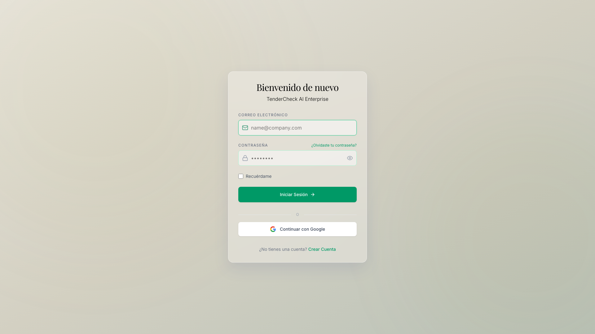
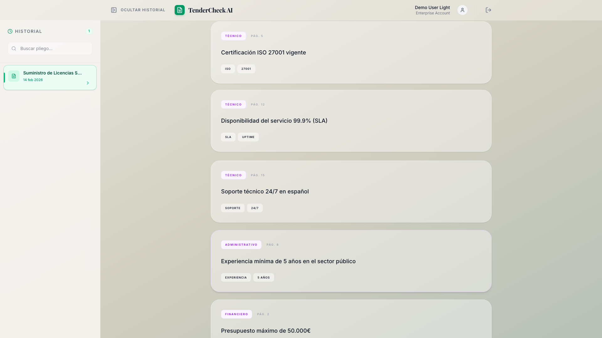

# TenderCheck AI 🤖

> **Automated Formal Validation for Public Tenders**
# TenderCheck AI 🚀

[](https://tendercheckai.elecodes.online)
[](https://github.com/elecodes/TenderCheck-AI/actions/workflows/ci.yml)
[](https://github.com/elecodes/TenderCheck-AI)

> **Empowering SMEs to win more tenders with AI-driven analysis and validation.**


-blue)


## 🚀 Key Features
- **Secure Authentication**: Hybrid Strategy (HttpOnly Cookies + Bearer Token Fallback) ensures reliability on all platforms. Google OAuth integration (Production-ready).
- **PDF Analysis**: Extracts text from tender documents to identify key requirements using **AI**: Gemini 2.5 Flash (Google AI Studio).
- **Clickable Citations**: Every extracted requirement shows its source page as a clickable badge. Opens a modal displaying the full page text with the AI-identified fragment highlighted — no more blind trust in AI output.
- **Observability**: **LangSmith** (via `traceable` SDK).
- **Requirement Extraction**: Identifies technical clauses, distinguishing **OBLIGATORIO** vs **OPCIONAL**.
- **Real Proposal Validation**: Real-time comparison of vendor proposals with AI reasoning.
- **Improved AI Summary**: Detailed analysis summaries up to 500 characters (truncated from 100 in previous versions).
- **Intelligent Analysis (Dual Persona)**: 
  - **Legal Auditor (Extraction)**: Identifies strict requirements ("deberá", "obligatorio").
  - **Senior Evaluator (Validation)**: Understands technical synonyms and partial compliance nuances.
- **Large PDF Support**: Page-based chunking for documents up to 80+ pages. Automatically splits PDFs > 15 pages into 10-page chunks, processes them in parallel (up to 3 concurrent), and aggregates results.
- **Cloud Semantic Search**: Native Vector Search with Google Genkit (`gemini-embedding-001` - 3072D).
- **Cloud-Native Architecture**: Frontend + Backend on **Vercel** + **Turso** Database (Edge SQLite).
- **Modern React Interface**: 
  - **Dual Theme Support**: Comprehensive **Light** (Beige/Gold) and **Dark** (Charcoal/Emerald) modes with a global toggle.
  - **Premium Aesthetic**: **Glassmorphism** design with backdrop blurs, soft shadows, and mesh gradients.
  - **Typography**: Professional pairing of *Playfair Display* (Headings) and *Inter* (Body).
  - **Responsive Design**: Mobile-optimized Navigation and High-Contrast Accessibility.
- **Persistent History**: Stores all analyses in **Turso (Distributed SQLite)** for reliability.
- **Enterprise Auth**: **HttpOnly Cookies** (XSS Protection), "Remember Me" functionality, "Welcome Back" interstitial, and Google Sign-In.
- **History Management**: Browse, search, and delete previous analyses.
- **Professional Export**: Generate branded **PDF Reports**.
- **Dynamic Industry Validation**: Intelligent scope filtering that adapts to different sectors (Digital Services, Construction, etc.) using database-driven keyword presets.
- **Secure by Design**: Zod validation, Helmet protection, strict CORS (`ALLOWED_ORIGINS`), and specialized **401 Error Handling** for session recovery.
- **AI Observability**: Integrated with **LangSmith** for real-time tracing, prompt versioning, and performance monitoring.

## 📌 Overview
**TenderCheck AI** is an intelligent assistant designed to validate public tender documents. Originally built for local inference, it has pivoted to a **Cloud-Native Architecture** (Vercel + Turso + Gemini) to ensure stability, persistence, and performance.

🌐 **Live Application**: [https://tendercheckai.elecodes.online/](https://tendercheckai.elecodes.online/)

## Demo
<p align="center">

</p>

<p align="center">


</p>

<p align="center">


  
</p>


▶ Watch demo video
https://github.com/user-attachments/assets/338457ab-3e39-43c9-b377-9a2bf3889e1d

## 📚 Key Documentation
- **[📘 Developer Playbook](docs/PLAYBOOK.md)**: Setup, Workflows, Commands.
- **[📋 Project Plan](docs/PROJECT_PLAN.md)**: Roadmap & Phases.
- **[🚀 Deployment Guide](docs/deployment_guide.md)**: Deploy to Vercel.
- **[📖 Documentation Site](docs/)**: VitePress-powered docs.
  - **Live**: https://elecodes.github.io/TenderCheck-AI/
  - **Includes**: **35+ ADRs**, **18+ Standards** (Security, UX, Quality), and **System Architecture**.
  - **Local**: `npm run docs:dev` → http://localhost:5173/

## 🏗 Architecture
This project implements **Clean Architecture** with a Modular Monolith approach:

### High-Level Overview
```text
├── backend/
│   ├── src/
│   │   ├── domain/         # Entities, Repositories, Interfaces (Pure Logic)
│   │   ├── application/    # Use Cases & Services (Orchestration)
│   │   ├── infrastructure/ # DB Adapters (Turso), AI (Genkit), Middleware
│   │   └── presentation/   # Express Controllers & Routes
├── frontend/
│   ├── src/
│   │   ├── components/     # UI, Auth, Dashboard, Layout
│   │   ├── services/       # API, Auth, Export Services
│   │   └── pages/          # Main Application Views
├── tests/
│   ├── e2e/                # Playwright End-to-End flows
│   └── fixtures/           # Mock PDFs for testing
└── docs/                   # ADRs, Standards, and TFM Documentation
```

<details>
<summary>📂 View Detailed File Structure</summary>

<!-- TREE_START -->
```text
├── AGENTS.md
├── CHANGELOG.md
├── Dockerfile
├── README.md
├── backend
│   ├── Dockerfile
│   ├── eslint.config.js
│   ├── package-lock.json
│   ├── package.json
│   ├── scripts
│   │   ├── debug_gemini.ts
│   │   └── verify_cloud.ts
│   ├── src
│   │   ├── application
│   │   │   ├── services
│   │   │   │   └── AuthService.ts
│   │   │   └── use-cases
│   │   │       ├── CreateTender.spec.ts
│   │   │       ├── CreateTender.ts
│   │   │       └── ValidateProposal.ts
│   │   ├── config
│   │   │   ├── constants.ts
│   │   │   └── genkit.config.ts
│   │   ├── domain
│   │   │   ├── entities
│   │   │   │   ├── ComparisonResult.ts
│   │   │   │   ├── Requirement.ts
│   │   │   │   ├── TenderAnalysis.ts
│   │   │   │   ├── User.ts
│   │   │   │   └── ValidationResult.ts
│   │   │   ├── errors
│   │   │   │   └── AppError.ts
│   │   │   ├── interfaces
│   │   │   │   ├── IPdfParser.ts
│   │   │   │   ├── IRule.ts
│   │   │   │   └── ITenderAnalyzer.ts
│   │   │   ├── repositories
│   │   │   │   ├── ITenderRepository.ts
│   │   │   │   └── UserRepository.ts
│   │   │   ├── schemas
│   │   │   │   └── TenderAnalysisSchema.ts
│   │   │   ├── services
│   │   │   │   └── RequirementsExtractor.ts
│   │   │   └── validation
│   │   │       ├── ValidationEngine.ts
│   │   │       ├── ValidationRuleFactory.ts
│   │   │       └── rules
│   │   │           └── ScopeValidationRule.ts
│   │   ├── genkit
│   │   │   └── flows
│   │   │       ├── embeddings.ts
│   │   │       └── index.ts
│   │   ├── infrastructure
│   │   │   ├── adapters
│   │   │   │   └── PdfParserAdapter.ts
│   │   │   ├── config
│   │   │   │   └── genkit-telemetry.ts
│   │   │   ├── database
│   │   │   │   ├── SqliteDatabase.ts
│   │   │   │   ├── TursoDatabase.ts
│   │   │   │   └── schema.sql
│   │   │   ├── middleware
│   │   │   │   ├── authMiddleware.ts
│   │   │   │   └── errorHandler.ts
│   │   │   ├── repositories
│   │   │   │   ├── InMemoryTenderRepository.ts
│   │   │   │   ├── InMemoryUserRepository.ts
│   │   │   │   ├── TursoTenderRepository.ts
│   │   │   │   └── TursoUserRepository.ts
│   │   │   ├── schemas
│   │   │   │   └── LLMSchemas.ts
│   │   │   ├── services
│   │   │   │   ├── GeminiGenkitService.ts
│   │   │   │   └── VectorSearchService.ts
│   │   │   └── utils
│   │   │       ├── chunking.ts
│   │   │       └── safeExecute.ts
│   │   └── presentation
│   │       ├── controllers
│   │       │   ├── AuthController.ts
│   │       │   └── TenderController.ts
│   │       ├── routes
│   │       │   ├── AuthRoutes.ts
│   │       │   └── TenderRoutes.ts
│   │       └── server.ts
│   ├── test
│   │   ├── PdfParserAdapter.test.ts
│   │   ├── ValidationEngine.test.ts
│   │   ├── api_integration.test.ts
│   │   ├── application
│   │   │   ├── services
│   │   │   │   └── AuthService.test.ts
│   │   │   └── use-cases
│   │   │       └── ValidateProposal.test.ts
│   │   ├── domain
│   │   │   ├── AppError.test.ts
│   │   │   ├── RequirementsExtractor.test.ts
│   │   │   ├── TenderAnalysisSchema.test.ts
│   │   │   ├── ValidationEngine.test.ts
│   │   │   └── validation
│   │   │       ├── ValidationEngine.test.ts
│   │   │       ├── ValidationRuleFactory.test.ts
│   │   │       └── rules
│   │   │           └── ScopeValidationRule.test.ts
│   │   ├── infrastructure
│   │   │   ├── database
│   │   │   │   └── TursoDatabase.test.ts
│   │   │   ├── repositories
│   │   │   │   ├── TursoTenderRepository.test.ts
│   │   │   │   └── TursoUserRepository.test.ts
│   │   │   └── services
│   │   │       ├── GeminiGenkitService.test.ts
│   │   │       └── VectorSearchService.test.ts
│   │   ├── presentation
│   │   │   ├── controllers
│   │   │   │   ├── AuthController.test.ts
│   │   │   │   └── TenderController.test.ts
│   │   │   └── routes
│   │   │       └── TenderRoutes.test.ts
│   │   └── security.test.ts
│   ├── test-db-connection.js
│   ├── tsconfig.json
│   └── vitest.config.ts
├── ci_cd_plan.md
├── docker-compose.yml
├── docs
│   ├── ARCHITECTURE_SIMPLE_GUIDE.md
│   ├── CLEAN_ARCHITECTURE_MAP.md
│   ├── Light_mode
│   │   ├── Register.png
│   │   ├── Screenshot 2026-02-13 at 11.57.30.png
│   │   ├── Screenshot 2026-02-13 at 13.49.03.png
│   │   ├── Screenshot 2026-02-13 at 14.28.38.png
│   │   ├── dashboard.png
│   │   ├── landing.png
│   │   └── percentage.png
│   ├── PLAYBOOK.md
│   ├── PROJECT_PLAN.md
│   ├── Presentation
│   │   └── Final_TenderCheckAI_Presentation2026.pdf
│   ├── SRS.md
│   ├── TFM_PLAN.md
│   ├── Testing_docs
│   │   ├── Oferta_Offer_IT_Security.pdf
│   │   └── Pliego_Tender_IT_Security.pdf
│   ├── VALIDATION_REPORT.md
│   ├── adr
│   │   ├── 000-template.md
│   │   ├── 001-validation-strategy.md
│   │   ├── 002-frontend-stack.md
│   │   ├── 003-ai-integration.md
│   │   ├── 004-observability.md
│   │   ├── 005-google-auth-limitation.md
│   │   ├── 006-proposal-validation.md
│   │   ├── 007-rules-engine.md
│   │   ├── 008-local-auth-and-ollama.md
│   │   ├── 009-ui-theme-routing.md
│   │   ├── 010-security-hardening.md
│   │   ├── 011-local-sql-persistence.md
│   │   ├── 012-vector-search-performance.md
│   │   ├── 013-frontend-localization-security.md
│   │   ├── 014-cloud-authentication.md
│   │   ├── 015-cloud-deployment.md
│   │   ├── 016-cloud-pivot-render-turso.md
│   │   ├── 017-ai-logic-refinements.md
│   │   ├── 018-auth-strategy-pivot.md
│   │   ├── 019-frontend-ui-and-security.md
│   │   ├── 020-caching-strategy.md
│   │   ├── 021-quality-metrics-standard.md
│   │   ├── 022-mobile-first-ui.md
│   │   ├── 023-resilience-testing-strategy.md
│   │   ├── 024-auth-ux-enhancements.md
│   │   ├── 025-manual-native-redirect.md
│   │   ├── 026-dynamic-industry-validation.md
│   │   ├── 027-langsmith-tracing-integration.md
│   │   ├── 028-embedding-model-migration.md
│   │   ├── 029-enforce-https-turso.md
│   │   ├── 030-high-coverage-standard.md
│   │   ├── 031-auth-header-fallback.md
│   │   ├── 032-ui-design-system.md
│   │   ├── 033-auth-error-handling.md
│   │   ├── 034-global-theme-strategy.md
│   │   ├── 035-reaching-100-domain-coverage.md
│   │   ├── 036-vercel-frontend-deployment.md
│   │   ├── 037-remediate-protobufjs-vulnerability.md
│   │   ├── 038-vercel-fullstack-deployment.md
│   │   ├── 039-clickable-citations.md
│   │   ├── 040-google-oauth-pkce.md
│   │   ├── README.md
│   │   └── index.md
│   ├── architecture
│   │   ├── index.md
│   │   ├── mcp_feasibility_study.md
│   │   └── system_architecture.md
│   ├── deployment_guide.md
│   ├── index.md
│   ├── standards
│   │   ├── architecture_systems.md
│   │   ├── code_quality_policy.md
│   │   ├── coding_best_practices.md
│   │   ├── devops_policy.md
│   │   ├── devsecops_free_tools.md
│   │   ├── health_and_errors_policy.md
│   │   ├── index.md
│   │   ├── lifecycle_paradigms.md
│   │   ├── metrics_policy.md
│   │   ├── microcopy_policy.md
│   │   ├── quality_metrics.md
│   │   ├── requirements_UML.md
│   │   ├── secure_coding_practices.md
│   │   ├── security_policy.md
│   │   ├── sentry_policy.md
│   │   ├── solid_principles.md
│   │   ├── testing_policy.md
│   │   ├── usable_forms_best_practices.md
│   │   └── ux_accessibility_policy.md
│   └── tfm
│       ├── 00_analisis_detallado.md
│       ├── 01_introduccion_objetivos.md
│       ├── 02_marco_teorico.md
│       ├── 03_arquitectura.md
│       ├── 04_implementacion.md
│       └── index.md
├── frontend
│   ├── README.md
│   ├── eslint.config.js
│   ├── index.html
│   ├── package-lock.json
│   ├── package.json
│   ├── postcss.config.js
│   ├── public
│   │   ├── _headers
│   │   └── vite.svg
│   ├── src
│   │   ├── App.css
│   │   ├── App.test.tsx
│   │   ├── App.tsx
│   │   ├── assets
│   │   │   └── react.svg
│   │   ├── components
│   │   │   ├── auth
│   │   │   │   ├── ForgotPasswordForm.test.tsx
│   │   │   │   ├── ForgotPasswordForm.tsx
│   │   │   │   ├── GoogleLoginButton.test.tsx
│   │   │   │   ├── GoogleLoginButton.tsx
│   │   │   │   ├── LoginForm.test.tsx
│   │   │   │   ├── LoginForm.tsx
│   │   │   │   ├── RegisterForm.test.tsx
│   │   │   │   └── RegisterForm.tsx
│   │   │   ├── dashboard
│   │   │   │   ├── AnalysisResults.test.tsx
│   │   │   │   ├── AnalysisResults.tsx
│   │   │   │   ├── ComparisonResults.tsx
│   │   │   │   ├── Dashboard.tsx
│   │   │   │   ├── HistorySidebar.test.tsx
│   │   │   │   ├── HistorySidebar.tsx
│   │   │   │   ├── TenderUpload.test.tsx
│   │   │   │   ├── TenderUpload.tsx
│   │   │   │   ├── ValidationSummary.test.tsx
│   │   │   │   └── ValidationSummary.tsx
│   │   │   ├── layout
│   │   │   │   ├── Navbar.tsx
│   │   │   │   └── ProtectedRoute.tsx
│   │   │   └── ui
│   │   │       ├── CitationPreview.tsx
│   │   │       ├── SentryErrorBoundary.tsx
│   │   │       └── Skeleton.tsx
│   │   ├── context
│   │   │   ├── AuthContext.test.tsx
│   │   │   ├── AuthContext.tsx
│   │   │   └── ThemeContext.tsx
│   │   ├── index.css
│   │   ├── main.tsx
│   │   ├── pages
│   │   │   ├── LandingPage.test.tsx
│   │   │   └── LandingPage.tsx
│   │   ├── services
│   │   │   ├── api.ts
│   │   │   ├── auth.service.ts
│   │   │   └── export.service.ts
│   │   ├── test
│   │   │   └── setup.ts
│   │   └── types.ts
│   ├── tailwind.config.js
│   ├── tsconfig.app.json
│   ├── tsconfig.json
│   ├── tsconfig.node.json
│   ├── vercel.json
│   └── vite.config.ts
├── package-lock.json
├── package.json
├── playwright.config.ts
├── render.yaml
├── screenshots
│   ├── 00-landing-page-dark.png
│   ├── 00-landing-page-light.png
│   ├── 00-landing-page.png
│   ├── 01-login-page-dark.png
│   ├── 01-login-page-light.png
│   ├── 01-login-page.png
│   ├── 03-ready-to-analyze-dark.png
│   ├── 03-ready-to-analyze-light.png
│   ├── 03-ready-to-analyze.png
│   ├── 04-analysis-results-dark.png
│   ├── 04-analysis-results-light.png
│   ├── 04-analysis-results.png
│   ├── 05-validation-results-dark.png
│   ├── 05-validation-results-light.png
│   ├── 05-validation-results.png
│   ├── 0B-register-page-dark.png
│   ├── 0B-register-page-light.png
│   ├── 0B-register-page.png
│   └── demo-video-full.webm
├── scripts
│   └── docs-automator.js
├── start.sh
└── tests
    ├── e2e
    │   ├── screenshots-light.spec.ts
    │   ├── screenshots.spec.ts
    │   └── tender-flow.spec.ts
    └── fixtures
        └── dummy.pdf
```
<!-- TREE_END -->

For more details, see the [📘 Simple Architecture Guide](docs/ARCHITECTURE_SIMPLE_GUIDE.md).

</details>

## 🚀 Getting Started

### Prerequisites
- Node.js (LTS 22+)
- **Turso DB** (Connection URL + Token)
- **Google AI Studio Key** (Gemini)

### Installation
```bash
# 1. Clone
git clone <repo-url>

# 2. Install Backend
cd backend
npm install
# Create .env (see deployment_guide.md)

# 3. Install Frontend
cd ../frontend
npm install
```

### Running the Project
# Run Development Mode
# Backend (Port 3001)
cd backend && npm run dev

# Frontend (Port 3000)
cd frontend && npm run dev

## ⚠️ Known Limitations (Deployment)
- **Backend on Vercel**: The backend is deployed on Vercel at https://tendercheckai.elecodes.online/ - cold starts may take a few seconds on first request.
- **Google Authentication**: Fully functional. Uses custom **Manual Native Redirect** flow to bypass Cross-Origin limitations. Ensure `VITE_ENABLE_GOOGLE_AUTH` is set to `true`.
- **AI Service Costs**: While this project uses the **Google AI Studio Free Tier**, owners may incur costs if they upgrade to **Pay-as-you-go**. In the Free Tier, Google may use your data to improve their models.

### Troubleshooting
- **503 / Database Connection Errors**: Ensure your `TURSO_DB_URL` is correct. The system enforces `https://` for stability.
- **Vercel Build**: Backend deploys automatically from `/backend`. Ensure `VERCEL_PREPATH` matches your API routes.


### Testing
We enforce strict quality gates.
```bash
# Run Unit Tests via Vitest
npm test

# Run End-to-End Tests
npx playwright test

# View Test Report
npx playwright show-report

# Check Coverage (Critical Gate: 100% Domain)
# We have achieved **100% Domain / 92% Global Coverage**, ensuring absolute reliability 
# for core business rules and domain entities.
npm run test:coverage

# Run Security Scan (Snyk)
# Checks for vulnerabilities in dependencies.
npm run security:scan

```

#### 📂 Test Data
We provide sample documents in [`docs/Testing_docs`](docs/Testing_docs) to test the application's core features:
- **[📄 Tender / Pliego](docs/Testing_docs/Pliego_Tender_IT_Security.pdf)**: Use this to test the **Tender Analysis** flow.
- **[📄 Offer / Oferta](docs/Testing_docs/Oferta_Offer_IT_Security.pdf)**: Use this to test the **Proposal Validation** flow (requires a completed analysis).

## 📜 License
MIT
